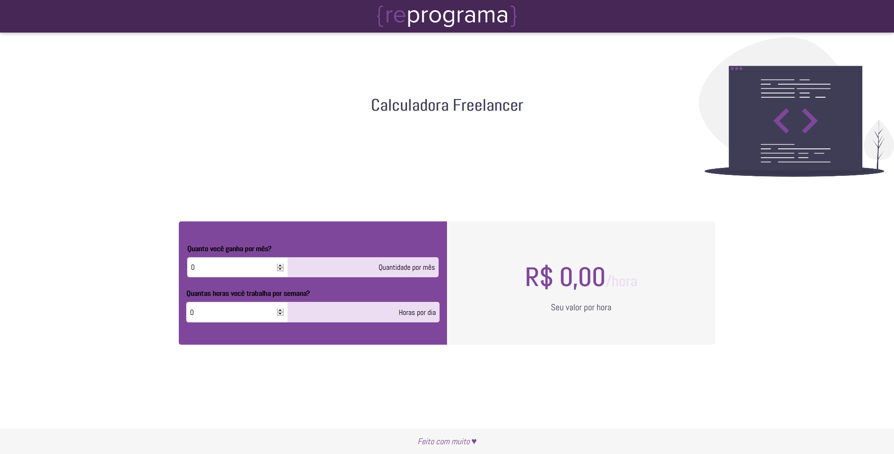

# {reprograma} - calculadora freela

<p align="center">
  
	
  <p align="center">
  O objetivo dessa calculadora é mostrar a partir de determinada entrada de horas trabalhadas vs salário base mês, quanto vale o seu valor/hora.
  </p>
  
</p>

## Introdução

---

### 09hrs~10hrs.

1. Apresentar sobre como será a dinâmica do dia;
	- Apresentação do contexto de desenvolvimento;
		- FrontEnd
		- Mobile
		- BackEnd -> foco especificamente do curso
	- Apresentar o que é uma linguagem de programação;
2. Apresentar quais desafios serão desenvolvidos no decorrer do dia;
	- Mostrar o resultado completo inicialmente e por quê estamos vendo dessa maneira os cálculos e como será visto no desenvolvimento do curso;
3. Se possível, com base no tempo, apresentar algum projeto de backend.

---

## Início do Desafio

### 10hrs ~ 12hrs

1. Apresentar HTML, CSS, essencialmente para entender o desenvolvimento básico, pois o foco será no cálculo;
2. Iniciar o desafio de javascript.
	- Recomendação: deixa o js já pronto no script. Se preferir, pode deixar dentro do index.html;
3. Neste período, eu sugiro realizar o início do script (indicado no arquivo script.js como //INÍCIO);
	- Selecionar os dados que o usuário digitar e imprimir na tela.

---

## Desenvolvimento do Desafio

### 13hrs ~ 14hrs

1. Sugestão, desenvolvimento do cálculo das horas (referência no script - // REALIZAR CONTA);
	- Imprimir no console;
2. Apresentando o resultado no console.log().

### 14hrs ~ 15hrs

1. Apresentar os dados na tela;
	- Referência no script.js: // APRESENTAR RESULTADO


---

## Sessão Dúvidas

### 15hrs ~ 16hrs

1. Tempo para dúvidas e finalização do processo para todas as alunas.

---

## Novos Desafios

### 16hrs ~ 17hrs

1. Apresentar o próximo desafio.
2. As alunas terão 24hrs para realizar o desafio seguinte que será:
2.1. Desenvolver a calculadora "inversa".
Dado uma nova tabela com os valores propostos abaixo, calcule o valor de um projeto com base nos dados:

```
Valor/Hora do seu Projeto x Qtd de Horas * Qtd de Dias;
```

